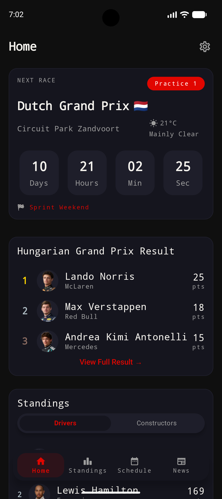
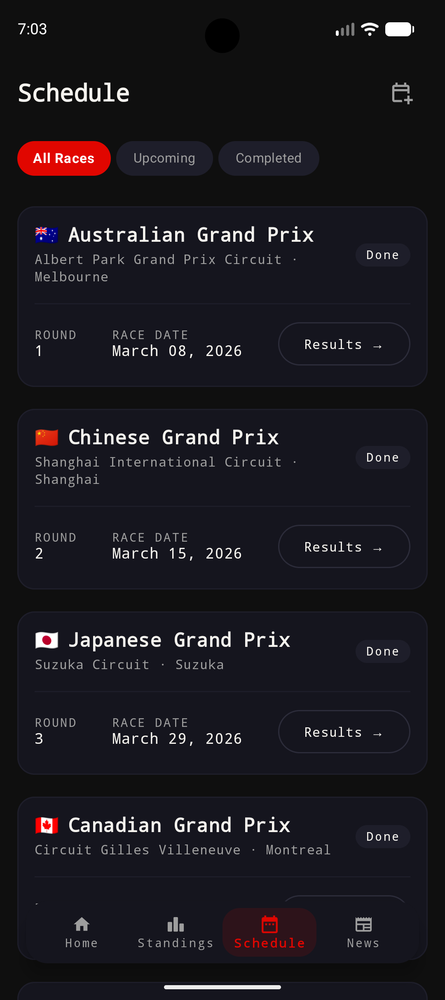
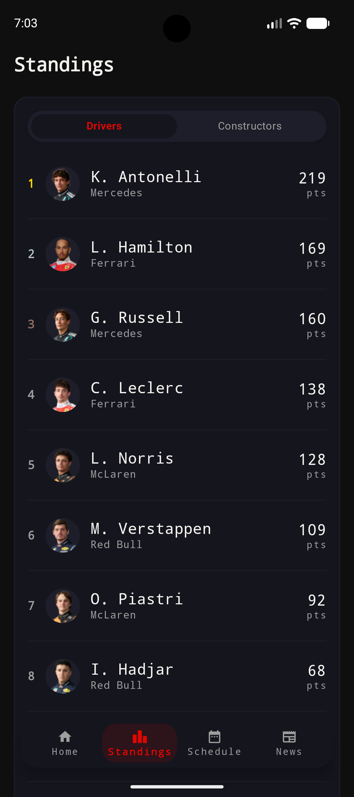

<p align="center">
  
</p>


# PitWall — A Modern F1 Companion for Android 🏁

PitWall is a sleek, high-performance Android app for Formula 1 fans that delivers real-time session status, season schedules, live standings, curated news, and configurable alerts — all in a lightweight, offline-friendly package.

---

## Screenshots

<p align="center">
  
  
  
</p>


---

## Key features ✨

- Real-time Home Dashboard
  - Next race countdown and quick glance of current session (FP, Qualifying, Sprint, Race)
  - Recent race results (podium)
  - Live session status and standings overview
  - Track weather snapshot
- Full Season Schedule
  - Complete Grand Prix weekends with session times and circuit info
- Live Standings
  - Drivers & Constructors leaderboards with points and position history
- F1 News Hub
  - Aggregated and parsed headlines from top F1 sources
- Personalization & Accessibility
  - Light/Dark theme support and event alerts
- Offline-first
  - Local caching for essential data so the app remains useful without connectivity

---

## Stack

- Language: Kotlin (100%)
- Framework / runtime: Android (Jetpack Compose, Material3)
- Notable libraries:
  - Hilt for dependency injection
  - Room for local persistence
  - Retrofit + OkHttp for networking
  - Coil for image loading
  - Jsoup for news parsing

---

## Project structure

app/src/main/java/com/jenil/f1comp/
  - data/
    - local/        — Room database, DAOs, entities (offline cache)
    - model/        — domain data models
    - remote/       — Retrofit API service definitions
    - repository/   — single source of truth and data orchestration
  - di/             — Hilt modules
  - ui/
    - components/   — reusable Compose UI components
    - navigation/   — app navigation and bottom bar
    - screen/       — feature screens (Home, Schedule, Standings, News, Settings)
    - theme/        — Material 3 theme definitions
    - state/        — UI state holders
  - viewmodel/      — ViewModels and business logic
  - util/           — helpers and mappers
F1Application.kt    — Application class (Hilt-enabled)
MainActivity.kt     — Compose entry point and navigation host

How it fits together:
- MainActivity sets up the Compose host and AppNavigation.
- ViewModels (viewmodel/) coordinate UI state and call repository methods.
- Repositories orchestrate data from remote (Retrofit) and local (Room) sources and expose flows for the UI.
- DI is handled with Hilt modules in di/ to provide Retrofit, Room, and other dependencies.

---

## Requirements

- Android Studio (2024.2 "Ladybug" or newer) or the latest stable release
- JDK 11 (configured for Kotlin JVM toolchain)
- Android SDK 26+ (compile/target: 36)

---

## Quick start (clone, build, run)

1. Clone the repository
   ```bash
   git clone https://github.com/JenilMacwan/Pitwall.git
   cd Pitwall
   ```

2. Open the project in Android Studio and let Gradle sync. Or build from the command line:

   - Assemble debug APK
     ```bash
     ./gradlew :app:assembleDebug
     ```

   - Install to a connected device/emulator
     ```bash
     ./gradlew :app:installDebug
     ```

3. Run the app from Android Studio (Run ▸ Run 'app') or launch the installed APK on your device.

4. Tests
   - Unit tests:
     ```bash
     ./gradlew test
     ```
   - Instrumentation / connected tests:
     ```bash
     ./gradlew connectedAndroidTest
     ```

---

## Configuration

- There are no special environment variables required by default.
- API endpoints and parsing behavior are defined in the remote/ and data/ modules; check those if you need to point the app at a different data source or mock server for development.

---

## Development notes

- Architecture: MVVM + Repository pattern (ViewModels expose StateFlows observed by Compose UI).
- Compose-first UI (Material3).
- DI: Hilt; generated code uses KSP.
- Local persistence: Room (ksp compiler for entities/DAOs).
- Testing: MockK for mocking, Turbine for StateFlow testing, kotlinx-coroutines-test for coroutine-based code.

---

## Contributing

Contributions, improvements and bug reports are welcome.

- Open an issue describing the bug/feature with steps to reproduce.
- Create a feature branch from main: `git checkout -b feat/your-feature`
- Keep changes focused and add tests where applicable.
- Open a pull request with a clear description of changes.

Code style:
- Follow Kotlin coding conventions and prefer idiomatic Compose patterns.
- Keep UI logic in Composables and business logic in ViewModels/repositories.

---

## Roadmap / Ideas

- Push notifications for session start/end and results
- Widget for home screen with next race and countdown
- Improved offline caching and background sync
- Locale & timezone improvements for session times

---

## Credits & author

Developed and maintained by Jenil Macwan — com.jenil.f1comp

---

## License

This project is licensed under the MIT License — see the LICENSE file for details.

---

## Questions you might want to ask next

- Where are the Retrofit interfaces and base endpoints defined (which file path) and what auth/headers do they require?
- Which classes in data/local implement Room entities and where are the migrations handled?
- Can you add a CONTRIBUTING.md and a sample GitHub Actions workflow that builds and runs unit tests on push?
